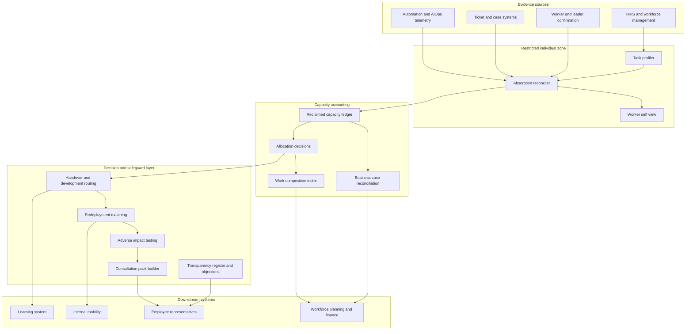

# Batonwork

**Source:** `ai-in-hr/Accenture-8343-HOW-IS-AI-HELPING-Transcript-Stg1-NG/`
**Domain:** `ai-hr`
**One-liner:** A task-absorption and redeployment record for augmented jobs that proves which tasks automation actually took over inside a role, how much working time came back, and where that time went — so "AI freed me up" becomes an auditable redeployment and upskilling decision instead of a line in an automation business case.
**Wedge:** Network operations and customer-support functions of 2,000–20,000-employee telecom, utility and managed-service employers in co-determination jurisdictions, where self-healing network automation or a support assistant is already live in at least one team and the works council has already asked what it did to the work.
**Positioning:** Augmentation accounting. Automation platforms report what the machine did; the HRIS reports what the person is still called; nothing in between records what changed inside the job. Batonwork owns that missing layer — the task-level before-and-after record, the reclaimed-capacity ledger, and the handover that moves a worker out of absorbed work into the judgment and relationship work the employer says it wants.

## Market research synthesis

### Thesis from source

The source is not an analyst framework — it is workers describing, in their own words, what happened to their jobs after automation arrived. That makes it unusually useful, because every claim in it is a claim about tasks rather than about headcount. One employee describes a support chatbot whose whole impact is that "it saves me time." A network operations worker describes the before state precisely: the business "was about monitoring people's networks, being able to look into issues that they have potentially raised with us," and the after state just as precisely: "once we deployed AI in the network, it means the network basically looks after itself." A data-handling worker quantifies their own status quo — "I do not need to spend 70-80% of my time to do a data clean" once rules can be set in the system through machine learning. These are three different task absorptions in three different roles, and not one of them corresponds to a job title changing.

The second thread is what happens to the time that comes back, and the source is emphatic that it should not disappear. The freed hours are described as going to work that "needs human interaction to actually do it," and the document closes on the reservation that businesses "have to be more empathetic and they have to show customers they care. And I don't think a machine can show you you care." The same worker voices say the work got harder in a good way: employees "are challenged more than they were challenged before, but at the same time I think they feel they are achieving more," and that the integration of AI "has driven up the skilling of our employees" because they are now exposed to more process data they must understand and present to the customer. The source frames the relationship not as substitution but as exchange: "I would consider AI as a partner of employees... If I know how to use AI it may provide me with information I need. But I will provide it with information as well."

The single most operationally loaded sentence in the document is a reported conversation: a team lead tells a worker "you are doing a really great job but I think that, I think you've reached a peak and I think it's time to hand this over so we can upskill you." That is a redeployment decision, a task handover, and a development commitment — made verbally, by one manager, with no record, no deadline, no owner, and no evidence base. Multiply that by every team in which something has been absorbed and the gap becomes the product: the mechanics of augmentation are entirely informal while the obligations attached to them are entirely formal. In a European employer, changing the organisation of work and introducing systems that monitor or allocate it triggers information and consultation duties; proposing redundancies triggers a duty to look for suitable alternative employment; selecting who moves and who does not is a selection decision that must survive a discrimination challenge.

What follows commercially is a narrow, defensible object: a per-role task ledger in which absorption is recorded as an event, the hours it returned are quantified, and the allocation of those hours is an explicit decision with an owner. Without that ledger, three predictable failures occur, all visible in the source's own subtext. Reclaimed capacity is silently reabsorbed by backlog, so the worker feels "challenged more" but the empathy work never materialises. The upskilling handover depends on having a good manager. And when the works council asks what the automation did to the work, the employer answers with the vendor's bot-run count, which is not an answer.

### Buyer & economic model

- **Primary buyer:** the operations director or COO who owns the automated function, co-signed by the HR director accountable for consultation and redeployment obligations. In multi-country employers the second signature is the one that closes the deal, because the exposure is legal rather than operational.
- **Users:** front-line workers in augmented roles (monthly confirmation of their own task record), team leaders (task inventory maintenance, capacity allocation, handover initiation), workforce planning analysts, learning and development leads who receive the triggered development routes, internal mobility recruiters, employee representatives and works council members (read and challenge), and HR compliance administrators.
- **Budget owner / value metric:** funded jointly from the automation programme budget and the workforce planning budget. The value metric is reclaimed hours per augmented FTE per quarter that are demonstrably allocated to judgment or relationship work, and the share of workers whose tasks were absorbed who moved into a higher-skilled role rather than into a redundancy pool. The avoided cost is external hiring and severance; the avoided risk is a failed consultation or an unfair-selection claim.
- **Competing status quo:** an RPA or AIOps dashboard counting automation runs and tickets deflected, a consultancy time-and-motion study that ages out in a quarter, the automation business case's assumed FTE avoidance carried forward unverified, the annual engagement survey as the only evidence about how the work feels, and the good manager's verbal handover offer.

### Domain constraints

- **Regulatory / trust / safety:** works councils and employee representative bodies in most of continental Europe hold information and consultation rights over changes in work organisation and the introduction of systems that monitor or allocate work, and those rights bite before implementation, not after. Redundancy law in most jurisdictions requires a genuine search for suitable alternative employment before dismissal, which makes recorded redeployment attempts evidentially valuable. Selection for redeployment or retention is a selection decision and must be testable for adverse impact across age, sex, disability, race and part-time status. Algorithmic management transparency obligations — the worker's right to understand when an automated system allocates or scores their work — apply to the automation being measured and to Batonwork itself.
- **Data sensitivity:** task-level measurement is employee monitoring. The same telemetry that proves a chatbot absorbed 40% of tier-one contacts can produce an individual productivity score, and once it can, it will be demanded. The product therefore has to be architecturally restrictive: management reporting resolves at role and team level only, individual-level task records are visible to the worker and their own development record, and task data is excluded by policy from performance, disciplinary and bonus processes. Union and works council trust is a precondition of data quality, because workers under-report absorption when reporting it looks like volunteering for redundancy.
- **Change-management realities:** team leaders will not maintain a second system of record, so absorption capture has to ride on telemetry the employer already generates plus a light monthly confirmation. Reclaimed capacity has a short half-life — if it is not allocated within a cycle it is consumed by backlog and cannot be recovered. And the empathy and relationship work the source values is precisely the work no existing system counts, so the product has to make it countable before it can protect it.

## Business requirements

- BR-1: No automation deployment that changes the work of an existing role may be signed off on assumed hours; each must carry a before-and-after task inventory for the affected roles with the reclaimed hours quantified from evidence, and the assumption must be reconciled against the measured outcome within two quarters.
- BR-2: Reclaimed capacity must be explicitly allocated within one planning cycle to one of a closed set of destinations — judgment and relationship work, protected learning time, demand absorption, or headcount reduction — and unallocated capacity must be reported as a default-to-backlog failure rather than quietly disappearing.
- BR-3: Any worker a majority of whose recorded task time has been absorbed acquires a documented development route with a named owner and a completion deadline, so that the source's "hand this over so we can upskill you" becomes an entitlement rather than a manager's initiative.
- BR-4: Selection for redeployment, retention or non-selection must be based on recorded task, skill and proficiency evidence, must be tested for adverse impact across protected groups before decisions are communicated, and must produce written reasons that the affected worker can appeal.
- BR-5: Task-level measurement must operate under stated purpose limitation: aggregated at role and team level for management and planning use, individually visible to the worker concerned, and contractually excluded from performance rating, disciplinary action and variable pay.
- BR-6: Where information and consultation duties apply, the platform must generate the consultation pack — task changes, affected populations, headcount effect, training plan and timetable — from the same records that management decisions are based on, so that employer and employee representatives argue from one set of facts rather than two.
- BR-7: The platform must evidence whether relationship and judgment work actually increased after absorption, not merely that routine work decreased, because the source's central worker claim is that freed time is for the interaction a machine cannot provide.
- BR-8: Each augmented role must carry a measured baseline and a target for the share of time spent on data preparation, rework and manual reconciliation, directly addressing the source's account of 70–80% of a role consumed by data cleaning.
- BR-9: Every automated rule that allocates, deflects or prioritises a worker's work must be disclosable to that worker in plain language, with a recorded route to challenge it and a service standard for responding.
- BR-10: Redundancy may only be proposed for an affected worker after recorded and dated redeployment attempts, with outcomes and reasons, so the employer can evidence its suitable-alternative-employment obligation.
- BR-11: The platform must return measurable value within a single automation programme cycle — evidenced redeployment at lower cost than external replacement hiring, or avoided severance — and must not require a completed job-architecture or skills-taxonomy programme before the first role can be instrumented.
- BR-12: Absorption records, capacity allocations, selection evidence, consultation packs and objection cases must be retained for the statutory limitation period for employment claims in each jurisdiction, with an immutable decision history.

## User stories

Canonical user stories live in sibling [USER_STORIES.md](USER_STORIES.md).

## System design

### Overview

Batonwork instruments a role rather than a person. It starts from a task profile — the named tasks a role performs, with an evidenced time distribution — and watches two streams against it: telemetry from the automation itself (deflection, auto-remediation, straight-through processing) and a light periodic confirmation from the workers and team leader who do the job. When the two streams agree that a task's human time has fallen, the system writes an absorption event and credits the reclaimed hours to the role's capacity ledger. Those credits are liabilities until allocated: a team leader must debit them to judgment and relationship work, to protected learning time, to absorbed demand growth, or to a headcount reduction proposal, and unallocated balances age visibly. Where absorption crosses a configured threshold for an individual, the system opens a handover — a development route, a skills gap, candidate internal roles, and a deadline — and where it crosses a collective threshold, it assembles the consultation pack. Selection decisions run through adverse impact testing before they are communicated, and every automated rule that touches a worker's queue is published to a transparency register with a challenge route attached.

### Actors & boundaries

- **Actors:** front-line worker, team leader, workforce planning analyst, learning and development lead, internal mobility recruiter, employee representative or works council member, HR compliance administrator, and the automation platform itself as a non-human source of evidence.
- **Trust boundary:** individual task records sit inside a restricted zone. Workers and their development record can see their own detail; management, planning and reporting surfaces receive role- and team-level aggregates with a minimum population threshold. Employee representatives receive the collective view plus any case they are formally representing. Outbound integrations to performance, payroll and variable pay systems are blocked by policy at the API boundary, not merely by convention, so that the purpose limitation is enforceable and demonstrable.
- **Human-in-the-loop points:** worker confirmation or correction of their own task record; team leader allocation of reclaimed capacity; handover initiation and development route approval; redeployment offer and acceptance; adverse impact review sign-off before selection communication; objection adjudication; consultation pack approval before issue.

### Core capabilities

1. **Task profiling** — the named task inventory per role, with evidenced time distribution, task family classification, and a marker for whether a task is routine, judgment-bearing or relationship-bearing.
2. **Absorption detection and confirmation** — reconciliation of automation telemetry with worker and leader confirmation into dated absorption events, with a disputed state when the two disagree.
3. **Reclaimed capacity ledger** — double-entry accounting of hours returned and hours allocated, with ageing of unallocated balances and reconciliation against the original business case.
4. **Work composition measurement** — tracking of the judgment, relationship and data-preparation shares of a role over time, so that the promise of more human interaction is measurable.
5. **Handover and development routing** — threshold-triggered development routes with owners, deadlines, skill gaps and learning commitments.
6. **Redeployment and internal mobility** — matching of affected workers to internal roles on evidenced task and skill overlap, with recorded offers, trial periods, acceptances and declines.
7. **Fairness testing** — adverse impact analysis of selection pools and redeployment outcomes across protected characteristics, run before communication.
8. **Consultation packs** — jurisdiction-configured generation of information and consultation documentation from live records, with version history.
9. **Transparency register and objections** — plain-language disclosure of automated allocation rules affecting workers, with a time-boxed challenge and adjudication process.
10. **Reporting and audit** — role, function and enterprise reporting plus immutable evidence export for tribunal, audit and works council use.

### Conceptual data

- **Primary entities:** Role, TaskProfile, Task, AutomationDeployment, AbsorptionEvent, TelemetrySignal, WorkerConfirmation, CapacityLedgerEntry, AllocationDecision, WorkComposition, Worker, SkillGap, DevelopmentRoute, RedeploymentOffer, SelectionPool, FairnessTest, ConsultationPack, TransparencyDisclosure, ObjectionCase, BusinessCaseReconciliation.
- **Critical events:** automation deployed against a role; task absorption detected; absorption confirmed or disputed by the worker; hours credited to the ledger; capacity allocated or aged out unallocated; handover opened; development route agreed and completed; redeployment offered, accepted or declined; selection pool proposed and fairness-tested; consultation pack issued; objection lodged and adjudicated; business case reconciled.
- **Retention / audit needs:** absorption records, allocation decisions, selection evidence, consultation packs and objection outcomes retained for the longest applicable employment-claim limitation period per jurisdiction, with an append-only decision history. Individual task telemetry retained on a short window and aggregated thereafter, since its lawful purpose is work design rather than permanent individual record-keeping.

### Integrations (conceptual)

- **Systems of record:** the HRIS for role, population, contract type and protected characteristic data held under restricted access; the workforce management or rostering system for scheduled hours; the learning system for development routes and completion; the internal mobility or applicant tracking system for redeployment offers; finance for the automation business case and cost per hour.
- **Upstream signals:** automation and AIOps platform telemetry, contact-centre deflection and containment metrics, straight-through processing rates from core operational systems, ticket and case systems for volume and handling time, and the periodic worker and leader confirmation as a first-class signal rather than an afterthought.
- **Downstream actions:** development route creation in the learning system, redeployment requisitions and offers, consultation pack issue to employee representatives, workforce plan updates, business case reconciliation entries to finance, and an explicit non-integration — a blocked path to performance, disciplinary and variable pay systems.

### High-level architecture

Two evidence streams converge on one ledger, and every decision that affects an individual passes through a fairness and transparency gate before it reaches them. The restricted zone around individual task data is what makes the rest of the system acceptable to the people it measures.

### Success metrics

- **Leading:** share of augmented roles with a current task profile and confirmed absorption records; worker confirmation rate and dispute rate on their own task records; reclaimed hours allocated within one cycle as a share of hours credited; median days from absorption threshold breach to an owned development route; share of automated allocation rules published to the transparency register; adverse impact tests completed before selection communication.
- **Lagging:** reclaimed hours per augmented FTE per quarter demonstrably allocated to judgment or relationship work; movement in the data-preparation share of role time against the source's 70–80% baseline claim; redeployment rate versus redundancy rate among workers with absorbed tasks; internal redeployment cost per placement against external replacement cost; variance between business-case promised hours and measured hours; consultation cycles completed without a formal dispute; objection volume, upheld rate and time to resolution; regretted attrition among workers in augmented roles.

## OpenAPI skeleton

Canonical HTTP surface lives in sibling [openapi.yaml](openapi.yaml). Summary:

- **Base path:** `/v1/...`
- **Auth:** `X-API-Key` for system-to-system ingestion from automation, ticketing and HR platforms; Bearer JWT for operator, worker, representative and administrator sessions with role-scoped visibility.
- **Resource groups:** Roles, Absorption, Capacity, Handover, Redeployment, Fairness, Consultation, Transparency, Reporting.
