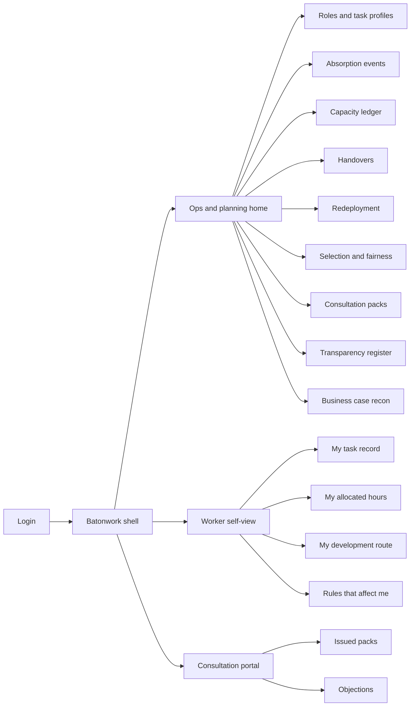
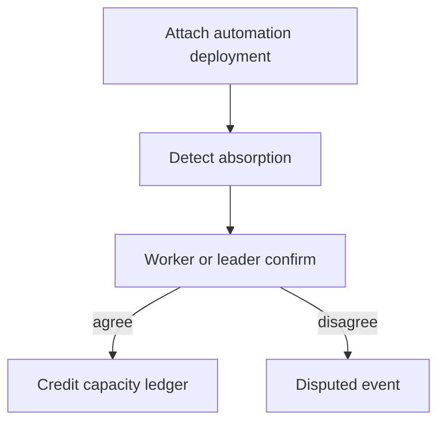
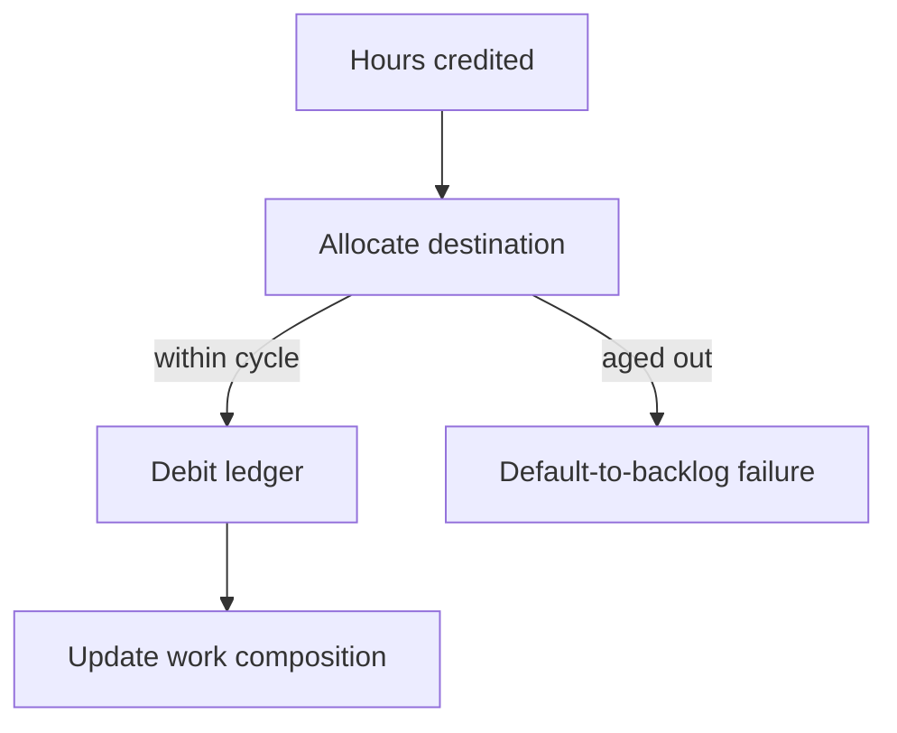

# Batonwork — Web app

**Product:** [PRODUCT.md](./PRODUCT.md)
**Primary surface:** Augmentation accounting console (ops + HR co-signed workspace)
**Secondary surfaces:** Worker self-view (task record + allocation truth); works council consultation portal (same facts, read/challenge)
**Design thesis:** Batonwork is a baton-pass ledger, not a productivity scoreboard. The UI metaphor is a relay handoff: tasks leave a worker’s hands into automation, reclaimed hours appear as liabilities on a capacity ledger, and every credit must be debited to judgment work, learning, demand, or a named headcount decision before it ages into “default-to-backlog.” Visual language is cool slate and signal-amber on a deep ink ground — confirmed absorptions feel settled like accounting entries; unallocated capacity pulses as debt; individual detail never leaks into management grids. The wordmark sits as a quiet mint seal on every ledger and consultation surface so co-determination parties know whose record they are arguing from.

## UX research synthesis

### Category peers (best-in-class)

- **Visier People:** Aggregate-first people analytics with minimum-cell suppression and drill that stops before individuals. Steal: role/team resolution as the default management lens; reject Visier’s broad “insight stories” framing where Batonwork needs a double-entry capacity ledger.
- **Gloat Talent Marketplace:** Internal mobility matching with skill overlap and offer trails. Steal: redeployment as a first-class offer object with accept/decline history; reject marketplace “browse jobs” aesthetics that signal voluntary career shopping rather than absorption-triggered entitlement.
- **Lattice:** Lightweight manager rituals (check-ins, confirmations) without a second system of record. Steal: monthly confirmation as a short, scannable ritual; reject review-cycle and performance-rating chrome — those integrations are explicitly blocked (BR-5).
- **Workday People Analytics / HCM:** Jurisdiction-aware workforce actions and consultation-adjacent reporting. Steal: role → population → decision trail density; reject headcount-only planning that cannot show task family absorption.

### Patterns to adopt / reject

- **Adopt:** Dual evidence streams (telemetry + confirmation) reconciled into dated AbsorptionEvents; capacity ledger with ageing unallocated balances; closed destination set for allocations; handover as entitlement with owner + deadline; fairness gate before selection communication; consultation packs generated from the same records as management decisions; purpose-limitation banners on every individual-adjacent view.
- **Reject:** Individual productivity heatmaps for managers; “AI freed time” vanity tiles without allocation debit; purple “insights” chat as the primary planner; editable settled absorption totals; rainbow engagement dashboards; performance-rating side panels.

### Trust, density, and workflow constraints from PRODUCT.md

Works councils must see the same task-change and training facts as management (BR-6) without receiving individual telemetry. Management reporting resolves at role/team with minimum population thresholds; workers see their own detail and can dispute (BR-5, BR-9). Reclaimed capacity has a short half-life (BR-2) — unallocated balances must be visually louder than “healthy green” KPIs. Adverse impact tests block communication until signed off (BR-4). Redundancy proposals require recorded redeployment attempts (BR-10). Retention of decision history is tribunal-grade (BR-12).

## Information architecture

### Nav model

### Roles → default home

| Role | Default home | Why |
|------|--------------|-----|
| Operations director / team leader | Capacity ledger for owned roles | Allocate reclaimed hours within the cycle (BR-2) |
| Workforce planning analyst | Business case reconciliation | Measured vs promised hours (BR-1) |
| Front-line worker | Worker self-view — task record | Confirm/correct absorption safely (BR-5) |
| L&D / mobility recruiter | Handover queue | Owned development routes (BR-3) |
| Works council / employee rep | Consultation portal | Same facts as management (BR-6) |
| HR compliance admin | Transparency + jurisdiction config | Purpose limitation and retention (BR-5, BR-12) |

### Cross-links to OpenAPI resources

| Nav area | OpenAPI tags / resources |
|----------|---------------------------|
| Roles and task profiles | Roles |
| Absorption events, confirmations | Absorption |
| Capacity ledger, allocations, work composition | Capacity |
| Handovers, development routes | Handover |
| Redeployment offers | Redeployment |
| Selection pools, fairness tests | Fairness |
| Consultation packs | Consultation |
| Disclosures, objections | Transparency |
| Business case recon, absorption summary | Reporting |

## Screen inventory

### Ops and planning home

- **Purpose:** Answer “how many reclaimed hours are still unallocated this cycle, and which roles are past absorption thresholds?” in one composition.
- **Entry:** Post-login for ops/planning/leader roles.
- **Layout regions:** Brand + org scope; unallocated capacity debt strip; roles past handover threshold; disputed absorption count; alerts rail (ageing balances, fairness tests pending).
- **Primary actions:** Allocate capacity; open disputed absorptions; jump to consultation triggers.
- **Empty / loading / error:** Empty = instrument first role against a live automation deployment; loading = skeleton debt strip + role list; error = retry with request id.
- **BR / story ties:** BR-1, BR-2; team leader and planning stories.

### Roles and task profiles

- **Purpose:** Maintain the named task inventory and evidenced time distribution per role — routine vs judgment vs relationship markers.
- **Entry:** Ops nav → Roles; deep link from automation deployment.
- **Layout regions:** Role list (instrumented status, absorption share); profile editor with task families and time bars; baseline vs target for data-preparation share (BR-8).
- **Primary actions:** Create/update profile; attach AutomationDeployment; open composition trend.
- **Empty / loading / error:** Empty = import from HRIS role + first telemetry map; validation on incomplete time distribution.
- **BR / story ties:** BR-1, BR-8, BR-11.

### Absorption events

- **Purpose:** Reconcile telemetry with worker/leader confirmation into dated absorption events; surface disputes when streams disagree.
- **Entry:** Home alert; Roles → Absorption.
- **Layout regions:** Event queue (detected / confirmed / disputed); dual evidence panes (telemetry vs confirmation); role-level aggregate strip (no individual names in manager view).
- **Primary actions:** Confirm; open dispute; credit hours to ledger on confirm.
- **Empty / loading / error:** Empty = “no detected absorptions this period”; disputed = amber dual-pane lock until resolved.
- **BR / story ties:** BR-1; worker correction stories.

### Capacity ledger

- **Purpose:** Double-entry view of hours credited and allocated; age unallocated balances; show default-to-backlog failures.
- **Entry:** Ops default; role drill-down.
- **Layout regions:** Ledger table (credit, debit destination, ageing); closed destination chips (judgment/relationship, learning, demand, headcount reduction); business-case variance aside.
- **Primary actions:** Allocate; propose headcount reduction (gated); export period.
- **Empty / loading / error:** Zero credits = healthy instrumented role with no absorption yet; aged unallocated = coral debt state.
- **BR / story ties:** BR-2, BR-7; team leader allocation stories.

### Work composition

- **Purpose:** Prove relationship and judgment work increased — not only that routine work decreased.
- **Entry:** Role detail; Reporting.
- **Layout regions:** Stacked composition over time (routine / judgment / relationship / data-prep); target lines; team-safe aggregates.
- **Primary actions:** Pin to consultation pack; export for COO review.
- **Empty / loading / error:** Insufficient population = suppressed chart with threshold message.
- **BR / story ties:** BR-7, BR-8.

### Handover and development routes

- **Purpose:** Threshold-triggered “hand this over so we can upskill you” with owner, deadline, skill gap, and LMS handoff.
- **Entry:** Home threshold alert; Handovers nav.
- **Layout regions:** Queue (deadline countdown); case view with absorption evidence, skill gap, candidate internal roles; route status.
- **Primary actions:** Assign owner; approve route; push to LMS; open redeployment if needed.
- **Empty / loading / error:** Empty = no threshold breaches; overdue = coral owner escalation.
- **BR / story ties:** BR-3; L&D stories.

### Redeployment offers

- **Purpose:** Match absorbed workers to internal roles on task/skill overlap; record offers, trials, acceptances, declines.
- **Entry:** Handover → Redeploy; mobility recruiter home.
- **Layout regions:** Match list; offer trail; reasons log; link to fairness pool when selection is competitive.
- **Primary actions:** Create offer; record response; mark suitable-alternative attempt for BR-10.
- **Empty / loading / error:** No matches = documented search steps still required before redundancy proposal.
- **BR / story ties:** BR-4, BR-10.

### Selection and fairness

- **Purpose:** Build selection pools, run adverse impact tests, block communication until sign-off.
- **Entry:** Planning; Redeployment competitive paths.
- **Layout regions:** Pool builder; protected-group impact table; written reasons templates; communication gate banner.
- **Primary actions:** Run fairness test; sign off; release communications; export for appeal.
- **Empty / loading / error:** Failed test = hard block with remediation checklist.
- **BR / story ties:** BR-4.

### Consultation packs

- **Purpose:** Generate jurisdiction-configured information and consultation documentation from live records — one set of facts.
- **Entry:** Compliance trigger; Council portal issue flow.
- **Layout regions:** Pack builder (task changes, populations, headcount effect, training plan, timetable); version history; issue log.
- **Primary actions:** Generate; approve; issue to representatives; freeze version.
- **Empty / loading / error:** Missing jurisdiction config = block generate with admin link.
- **BR / story ties:** BR-6, BR-12.

### Transparency register and objections

- **Purpose:** Plain-language disclosure of automated allocation/deflection rules; time-boxed worker/rep challenges.
- **Entry:** Worker disclosures; Ops Transparency; Council objections.
- **Layout regions:** Rule register; challenge form; adjudication timeline; service-standard clock.
- **Primary actions:** Publish rule; lodge objection; resolve with reasons.
- **Empty / loading / error:** Empty register for an automated queue = compliance warning, not success.
- **BR / story ties:** BR-9; representative objection stories.

### Worker self-view

- **Purpose:** Let the worker see their task list, reclaimed hours, allocation destinations, development route, and purpose-limitation assurance.
- **Entry:** Worker login default.
- **Layout regions:** My tasks (correctable); hours returned + where allocated; development route card; “not used for performance/pay” seal; disclosures affecting me.
- **Primary actions:** Confirm or dispute task record; open objection; view route owner.
- **Empty / loading / error:** No instrumented role = explain wait state; dispute submitted = amber pending.
- **BR / story ties:** BR-3, BR-5, BR-9; front-line worker stories.
- **Mobile notes:** Confirmation ritual must work on phone in one scroll; ledger detail can defer to desktop.

### Business case reconciliation report

- **Purpose:** Compare automation business-case promised hours to measured absorption and allocated destinations.
- **Entry:** Planning home; Reporting nav.
- **Layout regions:** Programme selector; promised vs measured vs allocated; variance narrative; export for finance.
- **Primary actions:** Reconcile period; attach to consultation; flag default-to-backlog.
- **Empty / loading / error:** No linked business case = prompt finance integration.
- **BR / story ties:** BR-1, BR-11.

## Key flows

1. **Instrument role and confirm absorption** — attach deployment → detect absorption → worker/leader confirm → credit ledger; failure: streams disagree → disputed state (no silent credit).

2. **Allocate reclaimed capacity** — credits appear as liabilities → leader allocates to closed destination set within cycle → composition updates; failure: aged unallocated reported as default-to-backlog (BR-2).

3. **Handover entitlement** — absorption threshold → open handover → owner + deadline → development route → LMS; failure: overdue escalates without closing entitlement (BR-3).

4. **Fair selection then consult** — build pool → fairness test → sign-off → generate consultation pack from same records → issue to reps; failure: failed adverse impact blocks communication (BR-4, BR-6).

5. **Redeployment before redundancy** — match → offer → record outcome → only then allow redundancy proposal path (BR-10).

## Design system

### Tokens (CSS variables)

- `--color-ink: #E6EDF2` — primary text on dark ground
- `--color-ground: #0A1016` — app ground
- `--color-panel: #121A24` — panels
- `--color-rule: #2A3848` — dividers
- `--color-mint: #3ECF8E` — confirmed absorption / settled credit
- `--color-mint-dim: #1A6B4A` — mint on dark
- `--color-amber: #E0A03A` — disputed / unallocated ageing
- `--color-coral: #E25B4A` — overdue handover / fairness block / consultation trigger
- `--color-steel: #7B93A8` — secondary labels
- `--color-brand: #8FCBB5` — Batonwork wordmark (quiet mint seal)
- `--font-display: "IBM Plex Sans", sans-serif` — chrome and KPIs
- `--font-mono: "IBM Plex Mono", monospace` — ledger ids, pack versions, rule ids
- `--space-1`…`--space-8`: 4px scale
- `--radius-sm: 4px`; `--radius-md: 8px` — accounting-sharp, not pill-heavy
- `--motion-credit: 180ms ease-out` — ledger credit flash
- `--motion-age: 280ms ease-in-out` — amber pulse on ageing unallocated
- `--motion-handoff: 220ms ease-out` — baton-pass highlight when allocation posts
- Atmosphere: subtle horizontal ledger hairlines on panel surfaces; soft top vignette; no stock “happy team” photography in console.

### Typography & brand

- Display for capacity numerals and screen titles; mono for event ids, pack versions, disclosure rule codes.
- Brand wordmark left of shell on every ledger, fairness, and consultation view; never replaced by a generic “Dashboard” as the strongest mark.
- Login/marketing shell: brand as hero; one headline (“Prove what automation took — and where the hours went”); one CTA — no engagement-stat strips.

### Do / don’t

- **Do:** Treat confirmed absorptions as visually locked; show unallocated capacity as debt; dual-pane evidence on disputes; suppress individual rows in management aggregates; stamp purpose-limitation on worker-adjacent screens.
- **Don’t:** Purple AI glow; manager heatmaps of individual pace; editable settled credits; card grids of vanity “AI impact” scores; emoji status; performance-rating widgets.

### Accessibility & domain trust cues

- Contrast AA+ on mint/amber/coral against ground; settled vs disputed also via lock icon + text, not colour alone.
- Live regions announce ageing balances, fairness blocks, and objection deadlines.
- Focus order follows baton flow: profile → absorption → ledger → handover → fairness → consultation.
- Consultation portal exposes machine-readable pack hashes for representatives.

## Component patterns

- **AbsorptionEventRow** — detected / confirmed / disputed with dual-evidence affordance.
- **CapacityLedgerEntry** — credit/debit with destination enum and ageing state.
- **UnallocatedDebtStrip** — cycle clock + hours still liable.
- **WorkCompositionStack** — routine / judgment / relationship / data-prep over time.
- **HandoverDeadlineChip** — owner + countdown; coral when overdue.
- **FairnessGateBanner** — blocks selection communication until sign-off.
- **ConsultationPackExport** — versioned pack from live records.
- **PurposeLimitationSeal** — persistent “excluded from performance/pay” cue.
- **TransparencyRuleCard** — plain-language automated rule + challenge CTA.

## Out of scope for v1 web

- Native mobile apps beyond responsive worker confirmation; full LMS course authoring; ATS replacement; RPA/AIOps bot builders; works-council document DMS beyond issued packs; payroll/performance integrations (explicitly blocked); multi-employer union federation portals.
